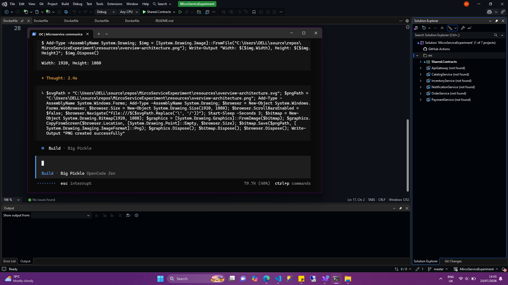

# Microservice Architecture Experiment

A production-like microservice architecture demonstrating how various services interact via multiple communication protocols including event-driven messaging, HTTP/2, and gRPC.

## Table of Contents

- [Architecture Overview](#architecture-overview)
- [Services](#services)
- [Communication Patterns](#communication-patterns)
- [Infrastructure](#infrastructure)
- [Getting Started](#getting-started)
- [Trade-offs and Design Decisions](#trade-offs-and-design-decisions)
- [Observability](#observability)
- [Testing the System](#testing-the-system)

---

## Architecture Overview



---

## Services

### 1. ApiGateway (`src/ApiGateway/`)

**Role:** Single entry point for external clients. Routes requests to backend services with resilience policies.

| Aspect | Detail |
|--------|--------|
| **Port** | 5000 (HTTP), 5001 (HTTPS) |
| **Pattern** | API Gateway + Service Mesh Simulation |
| **Communication** | Synchronous HTTP to backend services |
| **Resilience** | Polly v8 (retry, circuit breaker, timeout) |
| **Tracing** | Correlation ID middleware, OpenTelemetry |

**Key Files:**
- `Controllers/GatewayController.cs` - Routes requests to Catalog, Order, Payment services
- `Clients/CatalogClient.cs`, `OrderClient.cs`, `PaymentClient.cs` - Typed HTTP clients
- `Middleware/CorrelationIdMiddleware.cs` - Adds `X-Correlation-Id` to all requests

**Endpoints:**
```
GET  /api/gateway/products          → CatalogService
GET  /api/gateway/products/{id}     → CatalogService
GET  /api/gateway/orders/{id}       → OrderService
POST /api/gateway/orders            → OrderService
GET  /api/gateway/payments/order/{id} → PaymentService
GET  /health                        → Health check
```

---

### 2. CatalogService (`src/CatalogService/`)

**Role:** Manages product catalog with CRUD operations, Redis caching, and gRPC streaming for inventory updates.

| Aspect | Detail |
|--------|--------|
| **Port** | 5010 (REST), 5011 (gRPC) |
| **Pattern** | REST API + Cache-Aside + gRPC Server Streaming |
| **Database** | PostgreSQL (`catalog_db`) |
| **Cache** | Redis (5-minute TTL) |
| **Tracing** | OpenTelemetry, Serilog |

**Key Files:**
- `Controllers/ProductsController.cs` - REST API with Redis caching
- `Data/CatalogDbContext.cs` - EF Core database context
- `Data/Entities/Product.cs` - Product entity
- `GrpcServices/InventoryGrpcServiceImpl.cs` - gRPC server for inventory streaming

**Endpoints:**
```
GET    /api/products          → List products (cached in Redis)
GET    /api/products/{id}     → Get product by ID
POST   /api/products          → Create product
PUT    /api/products/{id}     → Update product
DELETE /api/products/{id}     → Delete product
grpc   InventoryGrpcService   → Server streaming for stock updates
```

**Redis Caching Strategy:**
- Cache key: `catalog:product:{id}` or `catalog:product:all`
- 5-minute TTL
- Cache-aside: Check Redis → miss → query PostgreSQL → cache result
- Invalidation on write operations

---

### 3. OrderService (`src/OrderService/`)

**Role:** Core domain service demonstrating CQRS, Event Sourcing, and Saga orchestration.

| Aspect | Detail |
|--------|--------|
| **Port** | 5020 (REST), 5021 (gRPC) |
| **Pattern** | CQRS + Event Sourcing + Saga Orchestrator |
| **Write DB** | EventStoreDB (event log) |
| **Read DB** | PostgreSQL (`order_read_db`) |
| **Saga DB** | PostgreSQL (`saga_state_db`) |
| **Message Bus** | RabbitMQ via MassTransit |
| **Tracing** | OpenTelemetry, Serilog |

**Key Files:**
- `Domain/Order.cs` - Event-sourced aggregate root
- `EventStore/EventStoreRepository.cs` - EventStoreDB persistence
- `Cqrs/Commands/PlaceOrderCommand.cs` + `PlaceOrderHandler.cs` - Write side
- `Cqrs/Queries/GetOrderQuery.cs` + `GetOrderHandler.cs` - Read side
- `Sagas/OrderStateMachine.cs` - MassTransit saga orchestrator
- `ReadModel/OrderReadModel.cs` + `OrderReadDbContext.cs` - PostgreSQL read model
- `Controllers/OrdersController.cs` - REST API

**Endpoints:**
```
POST   /api/orders                    → Place order (triggers saga)
GET    /api/orders/{id}               → Get order (read model)
GET    /api/orders/customer/{id}      → Get customer's orders
grpc   OrderGrpcService               → gRPC order operations
```

**CQRS Flow:**
```
Command (Write):
  POST /api/orders → PlaceOrderCommand → MediatR → PlaceOrderHandler
    → Order.Create() → EventStoreDB (append events)
    → Update PostgreSQL read model
    → Publish OrderPlaced event → RabbitMQ

Query (Read):
  GET /api/orders/{id} → GetOrderQuery → MediatR → GetOrderHandler
    → PostgreSQL (fast, denormalized)
    → Return OrderDto
```

**Event Sourcing Flow:**
```
1. Client sends POST /api/orders
2. PlaceOrderHandler creates Order aggregate
3. Order.Create() raises OrderPlaced event
4. EventStoreRepository.SaveAsync() appends to EventStoreDB
5. Read model updated in PostgreSQL
6. OrderPlaced event published to RabbitMQ
7. Saga starts: sends ReserveInventoryCommand
```

**Saga State Machine:**
```
[Initial] ──OrderPlaced──► [Started]
    │
    │ ReserveInventoryCommand → InventoryService
    │
    ├──InventoryReserved──► [InventoryReserved]
    │                           │
    │                    ProcessPaymentCommand → PaymentService
    │                           │
    │               ┌───────────┼───────────┐
    │               │                       │
    │        PaymentSucceeded          PaymentFailed
    │               │                       │
    ▼               ▼                       ▼
        [Completed]                  [Failed]
                                    (ReleaseInventoryCommand)
                                    (OrderCancelled event)
```

---

### 4. InventoryService (`src/InventoryService/`)

**Role:** Manages stock levels, responds to order events via RabbitMQ.

| Aspect | Detail |
|--------|--------|
| **Port** | 5030 (REST), 5031 (gRPC) |
| **Pattern** | Event-Driven Consumer + Publisher |
| **Database** | PostgreSQL (`inventory_db`) |
| **Message Bus** | RabbitMQ via MassTransit |
| **Tracing** | OpenTelemetry, Serilog |

**Key Files:**
- `Consumers/OrderPlacedConsumer.cs` - Reserves inventory on order placement
- `Consumers/OrderCancelledConsumer.cs` - Releases inventory on cancellation
- `Controllers/InventoryController.cs` - REST API for inventory queries
- `Data/InventoryDbContext.cs` - EF Core database context
- `Data/Entities/InventoryItem.cs` - Inventory entity

**Events Consumed:**
- `OrderPlaced` → Reserve stock, publish `InventoryReserved` or `InventoryReservationFailed`
- `OrderCancelled` → Release stock

**Events Published:**
- `InventoryReserved` → Saga continues to payment step
- `InventoryReservationFailed` → Saga cancels order
- `InventoryLow` → NotificationService sends alert

**Inventory Reservation Logic:**
```
1. Receive OrderPlaced event
2. For each line item:
   a. Look up InventoryItem by ProductId
   b. Check if AvailableQuantity >= requested Quantity
   c. If insufficient → add to failedItems list
   d. If sufficient → decrement AvailableQuantity, increment ReservedQuantity
   e. If stock below threshold → publish InventoryLow event
3. After all items:
   a. If any failures → publish InventoryReservationFailed
   b. If all succeeded → publish InventoryReserved
```

---

### 5. PaymentService (`src/PaymentService/`)

**Role:** Processes payments (simulated) and participates in the order saga.

| Aspect | Detail |
|--------|--------|
| **Port** | 5040 (REST) |
| **Pattern** | Saga Participant + Event Publisher |
| **Database** | None (stateless) |
| **Message Bus** | RabbitMQ via MassTransit |
| **Tracing** | OpenTelemetry, Serilog |

**Key Files:**
- `Consumers/ProcessPaymentConsumer.cs` - Processes payment commands
- `Controllers/PaymentsController.cs` - REST API for payment status
- `Commands/ProcessPaymentCommand.cs` - Local copy of saga command

**Events Consumed:**
- `ProcessPaymentCommand` → Process payment, publish result

**Events Published:**
- `PaymentSucceeded` → Saga completes order
- `PaymentFailed` → Saga releases inventory and cancels order

**Payment Simulation:**
```
1. Receive ProcessPaymentCommand
2. Simulate 500ms processing delay
3. 90% success rate (random)
4. On success: generate transaction ID, publish PaymentSucceeded
5. On failure: publish PaymentFailed with reason
```

---

### 6. NotificationService (`src/NotificationService/`)

**Role:** Sends notifications based on events (pure event consumer).

| Aspect | Detail |
|--------|--------|
| **Port** | 5050 (REST), 5051 (gRPC) |
| **Pattern** | Pure Event Consumer |
| **Database** | None |
| **Message Bus** | RabbitMQ via MassTransit |
| **Tracing** | OpenTelemetry, Serilog |

**Key Files:**
- `Consumers/PaymentSucceededConsumer.cs` - Logs payment confirmation
- `Consumers/PaymentFailedConsumer.cs` - Logs payment failure
- `Consumers/InventoryLowConsumer.cs` - Logs low stock alert
- `Consumers/OrderPlacedConsumer.cs` - Logs order confirmation

**Events Consumed:**
- `PaymentSucceeded` → "Payment confirmation sent to customer {CustomerId}"
- `PaymentFailed` → "Payment failure notification sent to customer {CustomerId}"
- `InventoryLow` → "Low stock alert: {ProductName} has only {CurrentQuantity} units"
- `OrderPlaced` → "Order confirmation sent to customer {CustomerId}"

---

### 7. Shared.Contracts (`src/Shared.Contracts/`)

**Role:** Shared event contracts and DTOs used across all services.

| Aspect | Detail |
|--------|--------|
| **Type** | Class Library |
| **Target** | .NET 8.0 |
| **Dependencies** | MassTransit |

**Events (namespace: `Shared.Contracts.Events`):**
- `OrderPlaced` - Order created
- `OrderCancelled` - Order cancelled
- `InventoryReserved` - Stock confirmed
- `InventoryReservationFailed` - Stock insufficient
- `InventoryLow` - Stock below threshold
- `PaymentSucceeded` - Payment completed
- `PaymentFailed` - Payment declined

**DTOs (namespace: `Shared.Contracts.Dtos`):**
- `ProductDto` - Product information
- `OrderDto` - Order information
- `CreateOrderRequest` - Order creation request
- `InventoryDto` - Inventory information
- `NotificationDto` - Notification data

---

## Communication Patterns

### 1. Synchronous REST/HTTP2

**Where:** ApiGateway → Backend Services

**How:**
- Typed `HttpClient` with `IHttpClientFactory`
- HTTP/2 support via Kestrel
- JSON serialization
- Polly resilience policies

**Pros:**
- Simple, well-understood
- Human-readable (debugging)
- Broad tooling support

**Cons:**
- Tight coupling (caller waits for response)
- Single point of failure (if service is down, caller fails)
- No automatic retry without resilience library

---

### 2. gRPC (Binary Protocol)

**Where:** CatalogService ↔ InventoryService, ApiGateway → OrderService

**How:**
- Protocol Buffers (binary format)
- HTTP/2 multiplexing
- Server streaming for real-time updates

**Pros:**
- ~10x smaller than JSON
- Strong typing with code generation
- HTTP/2 multiplexing (multiple requests over single connection)
- Server/client/bidirectional streaming

**Cons:**
- Not human-readable (harder to debug)
- Browser support limited (requires gRPC-Web)
- Steeper learning curve

---

### 3. Event-Driven Pub/Sub (RabbitMQ + MassTransit)

**Where:** OrderService → InventoryService, PaymentService → NotificationService

**How:**
- MassTransit abstracts RabbitMQ
- Events published to exchanges
- Consumers subscribe to queues
- Automatic retry, error queues

**Pros:**
- Loose coupling (publisher doesn't know about consumers)
- Asynchronous (publisher doesn't wait)
- Scalable (add consumers without changing publisher)
- Fault-tolerant (messages survive service restarts)

**Cons:**
- Eventual consistency (no immediate response)
- Debugging harder (trace through message broker)
- Message ordering not guaranteed across queues

---

### 4. CQRS (Command Query Responsibility Segregation)

**Where:** OrderService

**How:**
- Commands (writes) → EventStoreDB (append-only event log)
- Queries (reads) → PostgreSQL (denormalized read model)
- MediatR dispatches commands/queries to handlers

**Pros:**
- Optimized read/write models independently
- Read model is fast (denormalized, indexed)
- Write model is complete audit trail (events)

**Cons:**
- Eventual consistency (read model lags behind write model)
- Complexity (two data stores, projections)
- More code to maintain

---

### 5. Event Sourcing

**Where:** OrderService write model

**How:**
- Every state change stored as immutable event
- EventStoreDB stores event log
- Current state derived by replaying events

**Pros:**
- Complete audit trail (every change recorded)
- Time travel (reconstruct state at any point)
- Debugging (replay events to reproduce bugs)
- Temporal queries ("what was the order state 2 hours ago?")

**Cons:**
- Complexity (event schema evolution, snapshots)
- Storage grows over time
- Querying current state requires replaying events (slow without projections)

---

### 6. Saga Pattern (Orchestration)

**Where:** OrderService → InventoryService, PaymentService

**How:**
- MassTransit state machine orchestrates workflow
- Each step has a forward action and compensating action
- Saga state persisted in PostgreSQL

**Flow:**
```
1. OrderPlaced → ReserveInventory (command to InventoryService)
2. InventoryReserved → ProcessPayment (command to PaymentService)
3. PaymentSucceeded → Order Confirmed
4. On failure → Compensating actions (ReleaseInventory, CancelOrder)
```

**Pros:**
- Manages distributed transactions without 2PC
- Compensating actions handle failures gracefully
- State persisted (survives service restarts)

**Cons:**
- Complexity (state machine, compensation logic)
- Eventual consistency (steps are asynchronous)
- Debugging complex workflows

---

### 7. Service Mesh Simulation (Polly)

**Where:** ApiGateway outbound calls

**How:**
- Polly v8 resilience pipelines
- Retry with exponential backoff + jitter
- Circuit breaker (50% failure ratio, 30s window)
- Timeout (10s)

**Pros:**
- No infrastructure overhead (no Istio/Envoy)
- Application-level resilience
- Configurable per service

**Cons:**
- Application code responsible for resilience
- No traffic management (load balancing, routing)
- No mutual TLS (mTLS)

---

## Infrastructure

### Docker Compose Services

| Service | Image | Purpose | Port |
|---------|-------|---------|------|
| RabbitMQ | rabbitmq:3.13-management | Message broker | 5672, 15672 (UI) |
| EventStoreDB | eventstore/eventstore:latest | Event sourcing | 2113, 1113 |
| PostgreSQL | postgres:16-alpine | Relational DB | 5432 |
| Redis | redis:7-alpine | Cache | 6379 |
| Jaeger | jaegertracing/all-in-one:1.57 | Distributed tracing | 16686 (UI) |
| Prometheus | prom/prometheus:latest | Metrics | 9090 |
| Grafana | grafana/grafana:latest | Dashboards | 3000 (admin/admin) |

### PostgreSQL Databases

| Database | Service | Purpose |
|----------|---------|---------|
| `catalog_db` | CatalogService | Product catalog |
| `order_read_db` | OrderService | CQRS read model |
| `saga_state_db` | OrderService | Saga state persistence |
| `inventory_db` | InventoryService | Stock records |

---

## Getting Started

### Prerequisites

- Docker Desktop (with Docker Compose v2+)
- .NET 8.0 SDK (for local development)
- 8GB+ RAM (for running all containers)

### Quick Start

```bash
# Clone the repository
git clone <repository-url>
cd MircoServiceExperiment

# Start all services
docker-compose up --build

# Or run in background
docker-compose up --build -d
```

### Service URLs

| Service | URL |
|---------|-----|
| ApiGateway | http://localhost:5000 |
| CatalogService | http://localhost:5010 |
| OrderService | http://localhost:5020 |
| InventoryService | http://localhost:5030 |
| PaymentService | http://localhost:5040 |
| NotificationService | http://localhost:5050 |

### Infrastructure UIs

| UI | URL | Credentials |
|----|-----|-------------|
| RabbitMQ Management | http://localhost:15672 | guest/guest |
| EventStoreDB | http://localhost:2113 | admin/changeit |
| Jaeger Tracing | http://localhost:16686 | - |
| Prometheus | http://localhost:9090 | - |
| Grafana | http://localhost:3000 | admin/admin |

---

## Trade-offs and Design Decisions

### 1. MassTransit over Raw RabbitMQ.Client

**Decision:** Use MassTransit as the service bus abstraction.

**Why:**
- Type-safe message handling (strongly typed consumers)
- Saga state machines (built-in support)
- Automatic retry, error queues, circuit breakers
- Provider-agnostic (can switch to Azure Service Bus, etc.)

**Trade-off:**
- Abstraction overhead (harder to debug low-level issues)
- Version coupling (MassTransit updates may break code)
- Learning curve for MassTransit-specific patterns

---

### 2. Event Sourcing vs Traditional CRUD

**Decision:** Use Event Sourcing for OrderService write model.

**Why:**
- Complete audit trail for orders (regulatory requirement)
- Temporal queries (reconstruct order at any point)
- Debugging (replay events to reproduce issues)

**Trade-off:**
- Complexity (event schema evolution, projections)
- Storage growth (events accumulate over time)
- Querying current state requires replaying events (mitigated by CQRS read model)

---

### 3. CQRS vs Single Model

**Decision:** Use CQRS for OrderService (separate read/write models).

**Why:**
- Read model optimized for fast queries (denormalized, indexed)
- Write model optimized for event appending (append-only)
- Independent scaling (read replicas for high read throughput)

**Trade-off:**
- Eventual consistency (read model lags behind write model)
- More infrastructure (EventStoreDB + PostgreSQL)
- More code (projections, event handlers)

---

### 4. Saga Orchestrator vs Choreography

**Decision:** Use Saga Orchestrator (central state machine) over Choreography (decentralized events).

**Why:**
- Clear workflow visibility (state machine defines all steps)
- Easier to debug (centralized orchestration)
- Compensating actions are explicit

**Trade-off:**
- Single point of failure (orchestrator must be available)
- More complex (state machine, compensation logic)
- Tighter coupling (orchestrator knows about all participants)

---

### 5. Redis Caching

**Decision:** Use Redis for CatalogService caching.

**Why:**
- ~1ms response time vs ~10-50ms for PostgreSQL
- Shared across service instances (horizontal scaling)
- TTL-based automatic expiration

**Trade-off:**
- Eventual consistency (cache may be stale)
- Cache invalidation complexity
- Additional infrastructure

---

### 6. Docker Compose vs Kubernetes

**Decision:** Use Docker Compose for local development.

**Why:**
- Simpler setup (single command to start everything)
- Lower resource requirements
- Good enough for development/demos

**Trade-off:**
- No auto-scaling
- No service discovery (hardcoded service names)
- No rolling updates
- Not production-ready

---

## Observability

### Distributed Tracing (Jaeger)

All services export traces via OpenTelemetry Protocol (OTLP) to Jaeger.

**How it works:**
1. ApiGateway receives request, generates correlation ID
2. Correlation ID propagated to all downstream services
3. Each service adds spans (timing data) to the trace
4. Jaeger UI shows full trace timeline with latencies

**Access:** http://localhost:16686

---

### Metrics (Prometheus + Grafana)

Prometheus scrapes metrics from all services every 15 seconds.

**Metrics collected:**
- Request rates (requests per second)
- Latency histograms (p50, p95, p99 response times)
- Error rates (4xx, 5xx responses)
- gRPC metrics (calls, latencies)

**Access:**
- Prometheus: http://localhost:9090
- Grafana: http://localhost:3000

---

### Structured Logging (Serilog)

All services use Serilog for structured logging.

**Log format:**
```json
{
  "@t": "2024-01-15T10:30:00Z",
  "@l": "Information",
  "@mt": "GET /api/products returned {Count} items",
  "Count": 5,
  "CorrelationId": "abc-123"
}
```

**Features:**
- JSON structured logs (searchable in log aggregation tools)
- Correlation ID in every log entry
- Log levels configurable per namespace

---

## Testing the System

### 1. Create a Product

```bash
curl -X POST http://localhost:5010/api/products \
  -H "Content-Type: application/json" \
  -d '{
    "name": "Test Product",
    "description": "A test product",
    "price": 29.99,
    "category": "Electronics",
    "initialStock": 100
  }'
```

### 2. Place an Order (Triggers Full Saga)

```bash
# First, get a product ID from the catalog
curl http://localhost:5010/api/products

# Place an order (replace PRODUCT_ID with actual ID)
curl -X POST http://localhost:5020/api/orders \
  -H "Content-Type: application/json" \
  -d '{
    "customerId": "550e8400-e29b-41d4-a716-446655440000",
    "items": [
      { "productId": "PRODUCT_ID", "quantity": 2 }
    ]
  }'
```

### 3. Check Order Status

```bash
# Replace ORDER_ID with the ID from step 2
curl http://localhost:5020/api/orders/ORDER_ID
```

### 4. View Traces in Jaeger

1. Open http://localhost:16686
2. Select service: `OrderService`
3. Click "Find Traces"
4. Click on a trace to see the full journey

### 5. Check RabbitMQ Queues

1. Open http://localhost:15672 (guest/guest)
2. Go to "Queues" tab
3. See messages flowing through:
   - `orderplaced_queue` (OrderPlaced events)
   - `inventoryreserved_queue` (InventoryReserved events)
   - `paymentsucceeded_queue` (PaymentSucceeded events)

---

## Project Structure

```
MircoServiceExperiment/
├── docker-compose.yml              # Infrastructure + services
├── init-scripts/
│   └── 01-create-databases.sql     # PostgreSQL init script
├── prometheus/
│   └── prometheus.yml              # Prometheus config
├── src/
│   ├── Shared.Contracts/           # Shared events + DTOs
│   │   ├── Events/                 # Event contracts
│   │   └── *.Dto.cs               # Data transfer objects
│   ├── ApiGateway/                 # Entry point + resilience
│   │   ├── Clients/                # Typed HTTP clients
│   │   ├── Controllers/            # Gateway controller
│   │   └── Middleware/             # Correlation ID
│   ├── CatalogService/             # Product catalog
│   │   ├── Controllers/            # REST API
│   │   ├── Data/                   # EF Core + entities
│   │   └── GrpcServices/           # gRPC server
│   ├── OrderService/               # CQRS + ES + Saga
│   │   ├── Controllers/            # REST API
│   │   ├── Domain/                 # Aggregate root
│   │   ├── EventStore/             # EventStoreDB repo
│   │   ├── Cqrs/Commands/          # Write side
│   │   ├── Cqrs/Queries/           # Read side
│   │   ├── Sagas/                  # State machine
│   │   └── ReadModel/              # PostgreSQL read model
│   ├── InventoryService/           # Event consumer
│   │   ├── Consumers/              # MassTransit consumers
│   │   ├── Controllers/            # REST API
│   │   └── Data/                   # EF Core + entities
│   ├── PaymentService/             # Saga participant
│   │   ├── Consumers/              # MassTransit consumer
│   │   ├── Controllers/            # REST API
│   │   └── Commands/               # Local command types
│   └── NotificationService/        # Event consumer
│       └── Consumers/              # MassTransit consumers
└── README.md                       # This file
```

---

## Additional Resources

- [MassTransit Documentation](https://masstransit.io/documentation)
- [EventStoreDB Documentation](https://developers.eventstore.com/)
- [OpenTelemetry .NET](https://opentelemetry.io/docs/languages/net/)
- [Polly Resilience](https://www.pollydocs.org/)
- [gRPC for .NET](https://learn.microsoft.com/aspnet/core/grpc/)

---

## License

This is an educational experiment for learning microservice architecture patterns.
