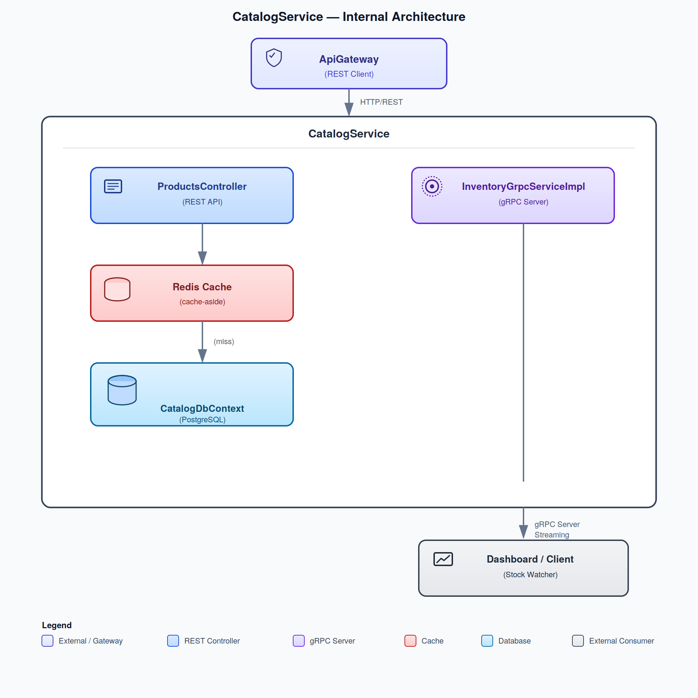

# CatalogService

REST API for product CRUD operations with PostgreSQL persistence, Redis caching, and gRPC server for real-time inventory streaming.

## Purpose

CatalogService manages the product catalog - the central source of truth for product information, pricing, and availability. It serves both external clients (via REST through ApiGateway) and internal services (via gRPC for real-time stock monitoring).

## Architecture



## How It Works

### REST API - Product CRUD

The `ProductsController` exposes full CRUD operations with Redis caching:

1. **GET /api/products** - List products (optional `?category=` filter)
   - Check Redis for cached results
   - On cache miss: query PostgreSQL, cache result for 5 minutes
   - Return product list

2. **GET /api/products/{id}** - Get single product
   - Check Redis for cached product
   - On cache miss: query PostgreSQL, cache individual product
   - Return product or 404

3. **POST /api/products** - Create product
   - Insert into PostgreSQL
   - Invalidate `catalog:product:all` and `catalog:product:category:{category}` cache keys
   - Return 201 Created

4. **PUT /api/products/{id}** - Update product
   - Update PostgreSQL
   - Invalidate product cache key and related list cache keys
   - Return updated product

5. **DELETE /api/products/{id}** - Delete product
   - Remove from PostgreSQL
   - Invalidate all related cache keys
   - Return 204 No Content

### Redis Caching Strategy

**Cache-aside pattern** (lazy loading):

```
Client Request
     │
     ▼
Check Redis Cache
     │
     ├── HIT ──► Return cached data
     │
     └── MISS ─► Query PostgreSQL
                      │
                      ▼
                 Store in Redis (TTL: 5 minutes)
                      │
                      ▼
                 Return data
```

**Cache Keys:**
| Key Pattern | Data | TTL |
|-------------|------|-----|
| `catalog:product:{id}` | Individual product JSON | 5 minutes |
| `catalog:product:all` | All products list JSON | 5 minutes |
| `catalog:product:category:{cat}` | Category-filtered list JSON | 5 minutes |

**Cache Invalidation:**
- On Create: Delete `all` and `category:{newProduct.category}`
- On Update: Delete product key, `all`, and `category:{updatedProduct.category}`
- On Delete: Delete product key, `all`, and `category:{deletedProduct.category}`

### gRPC Server - Real-Time Inventory Streaming

The `InventoryGrpcServiceImpl` implements a server streaming gRPC service defined in `inventory.proto`:

```protobuf
service InventoryGrpcService {
  rpc WatchStockLevels (StockWatchRequest) returns (stream StockUpdate);
}
```

**How it works:**

1. Client sends `StockWatchRequest` with product IDs to monitor
2. Server adds client to active subscribers (tracked in `ConcurrentDictionary`)
3. Server sends initial stock snapshot for each product
4. Server streams periodic `StockUpdate` messages every 5 seconds (simulated)
5. Stream continues until client disconnects or server shutdown

**StockUpdate message includes:**
- `ProductId`, `ProductName`
- `AvailableQuantity`, `ReservedQuantity`
- `Reason` (ORDER_PLACED, ORDER_CANCELLED, RESTOCK, MANUAL_ADJUSTMENT)

**Static broadcast method** `BroadcastStockUpdate()` can push updates to all connected clients - designed to be called by event handlers when inventory changes.

### Seed Data

On startup, if the database is empty, 5 sample products are seeded:

| Product | Price | Category | Stock |
|---------|-------|----------|-------|
| Wireless Mouse | $29.99 | Electronics | 150 |
| Mechanical Keyboard | $89.99 | Electronics | 75 |
| USB-C Hub | $49.99 | Electronics | 200 |
| Cotton T-Shirt | $19.99 | Clothing | 500 |
| Running Shoes | $79.99 | Sports | 100 |

## Key Files

| File | Purpose |
|------|---------|
| `Program.cs` | Entry point. Configures EF Core, Redis, gRPC, OpenTelemetry, Serilog, Swagger, CORS, seed data |
| `Controllers/ProductsController.cs` | REST API for product CRUD with Redis caching |
| `Data/CatalogDbContext.cs` | EF Core DbContext for PostgreSQL. Maps `products` table with indexes on Category and Name |
| `Data/Entities/Product.cs` | Product entity: Id, Name, Description, Price, Category, StockQuantity, CreatedAt, UpdatedAt |
| `GrpcServices/InventoryGrpcServiceImpl.cs` | gRPC server for real-time stock level streaming |
| `Protos/inventory.proto` | Protocol Buffer definition for gRPC service |
| `appsettings.json` | Connection strings, Serilog config |
| `Dockerfile` | Container build configuration |

## Database Schema

### Products Table

```sql
CREATE TABLE products (
    Id          UUID PRIMARY KEY,
    Name        VARCHAR(200) NOT NULL,
    Description VARCHAR(2000),
    Price       DECIMAL(18,2),
    Category    VARCHAR(100) NOT NULL,
    StockQuantity INTEGER DEFAULT 0,
    CreatedAt   TIMESTAMP,
    UpdatedAt   TIMESTAMP
);

CREATE INDEX idx_products_category ON products(Category);
CREATE INDEX idx_products_name ON products(Name);
```

## Configuration and Environment Variables

| Variable | Default | Description |
|----------|---------|-------------|
| `ConnectionStrings__CatalogDb` | `Host=localhost;Database=catalog_db;Username=postgres;Password=postgres` | PostgreSQL connection |
| `ConnectionStrings__Redis` | `localhost:6379` | Redis connection |
| `OTEL_EXPORTER_OTLP_ENDPOINT` | `http://localhost:4317` | OpenTelemetry OTLP endpoint |

**Docker Compose overrides:**
```yaml
environment:
  - ConnectionStrings__CatalogDb=Host=postgres;Database=catalog_db;Username=postgres;Password=postgres
  - ConnectionStrings__Redis=redis:6379
```

## How to Test

### Start the Service

```bash
dotnet run --project src/CatalogService
```

Runs on `http://localhost:5010` (REST) and gRPC port.

### Health Check

```bash
curl http://localhost:5010/health
```

### REST API Examples

```bash
# List all products
curl http://localhost:5010/api/products

# Filter by category
curl "http://localhost:5010/api/products?category=Electronics"

# Get single product
curl http://localhost:5010/api/products/{product-id}

# Create product
curl -X POST http://localhost:5010/api/products \
  -H "Content-Type: application/json" \
  -d '{"name": "Laptop", "description": "Gaming laptop", "price": 1299.99, "category": "Electronics", "initialStock": 50}'

# Update product
curl -X PUT http://localhost:5010/api/products/{product-id} \
  -H "Content-Type: application/json" \
  -d '{"price": 1199.99}'

# Delete product
curl -X DELETE http://localhost:5010/api/products/{product-id}
```

### Test Redis Caching

```bash
# First request - cache MISS (check logs)
curl http://localhost:5010/api/products

# Second request - cache HIT (check logs)
curl http://localhost:5010/api/products

# After 5 minutes - cache MISS again (TTL expired)
```

### Swagger UI

Available in Development mode at `http://localhost:5010/swagger`.

## Communication Patterns Demonstrated

| Pattern | Implementation |
|---------|---------------|
| **REST API** | Full CRUD endpoints for product management |
| **Cache-Aside** | Redis caching with 5-minute TTL, invalidation on writes |
| **gRPC Server Streaming** | Real-time stock level updates via `WatchStockLevels` |
| **Database Per Service** | Dedicated `catalog_db` PostgreSQL database |
| **Seed Data** | Automatic sample data on first startup |
| **OpenTelemetry** | Distributed tracing with EF Core instrumentation |

## Dependencies

- **Entity Framework Core** - PostgreSQL ORM
- **Npgsql** - PostgreSQL driver
- **StackExchange.Redis** - Redis client
- **Grpc.AspNetCore** - gRPC server framework
- **Serilog** - Structured logging
- **OpenTelemetry** - Distributed tracing
- **Swashbuckle** - Swagger/OpenAPI
